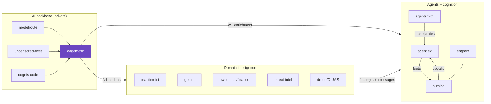

# Cognis interop map

How **yaragen** fits the wider Cognis suite — a composable set of defensive, analytical
tools that all run on your own hardware and speak plain **JSON** (or an OpenAI-compatible
**`/v1`**). `yaragen` lives in the **Malware / binary** cluster.



## Key edges

| from | relation | to |
|---|---|---|
| `yaragen` | JSON findings compose with | [`binhunt`](https://github.com/cognis-digital/binhunt), [`entropyscan`](https://github.com/cognis-digital/entropyscan) |
| `yaragen` | AI add-ins are served `/v1` by | [`edgemesh`](https://github.com/cognis-digital/edgemesh) (your fleet) |
| `yaragen` | findings can be narrated / reasoned over by | [`humind`](https://github.com/cognis-digital/humind) -> [`agentlex`](https://github.com/cognis-digital/agentlex) |
| `yaragen` | export to intel formats via | [`stixgen`](https://github.com/cognis-digital/stixgen) (STIX) / [`attackmap`](https://github.com/cognis-digital/attackmap) (ATT&CK) |

## Composition patterns

Everything reads/writes JSON, so tools chain with ordinary pipes; nothing leaves the box.

**1 — chain within the malware / binary cluster.** `yaragen` output feeds the next tool:
```bash
yaragen ... --format json > out.json          # this tool's findings (see `yaragen --help`)
binhunt ... < out.json                      # the cluster sibling consumes them
```

**2 — enrich with the private-AI backbone.** Point add-ins at one `/v1` for the whole fleet:
```bash
export OPENAI_BASE_URL=http://localhost:8080/v1   # an edgemesh gateway over your fleet
yaragen ...                                         # vision / reasoning add-ins light up
```

**3 — export findings to your SOC's formats.**
```bash
yaragen ... --format json | stixgen from-json > bundle.stix.json   # STIX 2.1
yaragen ... --format json | attackmap map > attack.json            # ATT&CK techniques
```

**4 — narrate through cognition + agents.** `humind` extracts salience from `yaragen`'s
output; `agentlex` holds it as KB facts and fires Horn rules to escalate. `yaragen` slots
into the **Threat-intel export** stack below.

## Reference stacks

Pick the smallest stack that answers your question; each is a subset of the 300+ suite.

| Stack | Representative repos | Flow |
|---|---|---|
| **Sanctions-evasion screening** | maritimeint + OFAC/OFSI/EU/OpenSanctions feeds | importers -> screen -> pass/fail gate |
| **GEOINT fusion** | locateanything - geolens - geoaoi-pro | imagery -> geolocate -> plot on AOI / MIL-STD-2525 |
| **Ownership & finance** | corpmap - cryptotrace - personagraph | entity -> beneficial owner -> wallets -> identity |
| **Threat-intel export** | stixgen - iocextract - attackmap - ttphunt | findings -> STIX / IOCs -> ATT&CK -> hunt |
| **Counter-UAS maritime** | maritimeint - uaslog - awesome-drone-warfare-osint | AIS + drone telemetry -> correlated picture |
| **Cognition + agents** | humind - agentlex - agentsmith - engram | extract -> KB facts/rules -> orchestrate -> memory |
| **Private-AI backbone** | edgemesh - modelroute - uncensored-fleet - cognis-code | one `/v1` powering every tool's add-ins |

Every domain stack sits **on top of** the private-AI backbone: point any tool's add-ins at
an `edgemesh` gateway (`OPENAI_BASE_URL`) and one fleet serves vision, reasoning, and
narration to all of them.

> Part of a cross-repo interop pass. **300+ tools ->** [github.com/cognis-digital](https://github.com/cognis-digital) - [awesome-cognis](https://github.com/cognis-digital/awesome-cognis)
